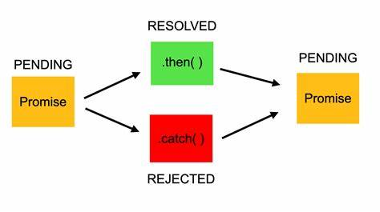
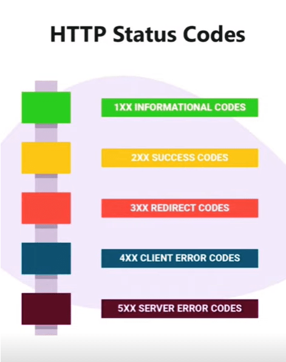

## JavaScript Core

- "use strict"
- Data types (Primitive and Non-primative or Reference)
- Variables ( var , let , const )
- Conditional operators ( if else , switch , ternary ) 
- Number & Number methods  
- Math methods
- String & String methods
- Type conversions vs coersion
- Truthy , Falthy 
- Nullish colasing ?? 
- Loops ( while , do while , for , for of , for in )
- Array  ( literal , new Array )
- Array methods ( push , pop ,shift , unshift , slice , splice , includes , join , reverse , sort, concat, flat)
- Object & Object methods
- Object.entries , Object.fromEntries , Object.freeze , assign, is, hasOwnProperty, defineProperty
- This
- Deep copy or Shallow copy
- Advanced functions  ()
- Functions factory , Function pipe , Function generator , Function Currying , IIFE
- Higher order functions: map , filter , foreach , reduce , sort 

##  DOM

- ### selector 

- getElementById , getElementsByTagName , getElementsByName , (HTMLCollection)
- querySelector , querySelectorAll (NodeList)

- Styiling elements el.stytle.property="value" , el.stytle.cssText="property:value"

- CSSstyleDecloration

- Attribute , setAttribute , getAttribute , hasAttribute 
- ClassList , add , remove , toggle , contains

- ### Dynamic elements in DOM 
- createElement('element')
- appendChild
- append
- prepend
- before , after

- ### DOM events

- mouse events
- keyboard events
- window events

- ## Storages
-  LocalStorage
-  Session storage
-  Cookies

- ### Data-set

 

- ## Promise

- Javascript syncronous

- JavaScript asynchronous

- await
- async

- then
- catch
- finally

- try & catch

- ### HTTPS Status 
- Informational responses (100 – 199)
- Successful responses (200 – 299)
- Redirection messages (300 – 399)
- Client error responses (400 – 499)
- Server error responses (500 – 599)

